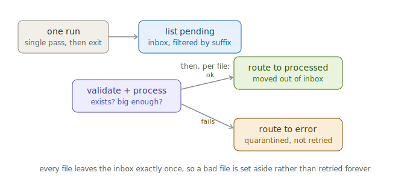
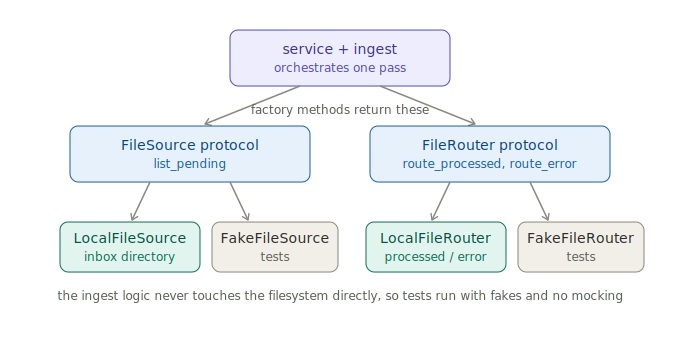

# File Ingest Service

A file ingestion service built around the classic drop-folder pattern: files
arrive in an `inbox` directory, each one is validated and processed, and every
file ends up in either `processed` or `error`.

It is also a **worked reference implementation** of an architecture worth
reusing — Protocol boundaries, a factory-method test seam, and behavior-based
tests with no mocking. The design notes below explain not just what the code
does but why it is shaped this way.

## How it works

Each run makes a single pass over the inbox and exits.



The routing rule is the heart of the design:

- **Every file leaves the inbox exactly once.** Success routes it to
  `processed`; any failure routes it to `error`.
- **Failure is quarantine, not retry.** A file that cannot be validated or
  processed is moved aside rather than left in place. This is a deliberate
  choice: a permanently bad file is set aside once instead of failing on every
  run forever. Services that leave a failed item in place to retry need a
  separate poison-item strategy; this design avoids that problem by construction.
- **One bad file never halts the batch.** Each file is handled in isolation and
  failures are returned, not raised.
- **Even a total failure is reported.** If a file cannot be routed at all (both
  the processed and error moves fail), the run still records a result rather
  than crashing.

## Architecture

The ingest logic depends on two boundary Protocols, not on the filesystem
directly, so it can be tested with in-memory fakes.



| Module | Responsibility |
|---|---|
| `cli.py` | Typer CLI: `run`, `read-config`, `seed`, `--version`. |
| `service.py` | Orchestrates one pass: list pending, handle each file, log the outcome. |
| `ingest.py` | The per-file rule: validate, process, route. Pure of any filesystem detail. |
| `protocols.py` | `FileSource` (inbound) and `FileRouter` (outbound) boundary interfaces. |
| `local_files.py` | `LocalFileSource` and `LocalFileRouter`: the filesystem implementations. |
| `paths.py` | The `inbox` / `processed` / `error` directory layout. |
| `settings.py` | Settings resolution (env > TOML > default) and validation. |
| `config.py` | Thin `resolve_settings()` entry point. |
| `logging.py` | Console + rotating-file logging. |

Three design decisions are worth calling out, because they are the reusable part:

**Two Protocols, sized to what the caller needs.** `FileSource` has exactly one
method because the ingest logic needs exactly one thing from the inbox.
`FileRouter` has exactly two because every file ends in exactly one of two
places. Neither interface has a method that exists "just in case."

**A factory-method seam instead of patching.** `Service` obtains its boundaries
through `_make_source()` and `_make_router()`. Tests subclass `Service` and
override those two methods to return fakes. There is no `unittest.mock` and no
string-path patching anywhere in the suite, so refactoring internals does not
break tests.

**Fakes over mocks.** `FakeFileRouter` records what was routed where and can
inject failures by filename. Tests assert on what actually happened (state)
rather than on which function was called (interaction), so they survive
refactors and read as a specification of the behavior.

## Configuration

Settings resolve in priority order: **environment variable > `config/app.toml`
> built-in default**. Environment variables use the prefix `APP_` (e.g.
`APP_DATA_DIR`, `APP_LOG_LEVEL`).

| Setting | Meaning |
|---|---|
| `data_dir` | Base directory containing `inbox`, `processed`, and `error`. |
| `allowed_suffixes` | Only these file types are picked up; others are ignored. |
| `min_size_bytes` | Files smaller than this fail validation and are quarantined. |
| `log_file` | Rotating log path, relative to the working directory. |

Setting `env = "PROD"` enables fail-fast validation: every field listed in
`REQUIRED_IN_PROD` must be non-empty or startup raises a clear error naming what
is missing.

## Quick start

```bash
uv run fis --help
uv run fis read-config          # print resolved settings
uv run fis seed                 # drop a sample file in the inbox
uv run fis run                  # process the inbox once
APP_LOG_LEVEL=DEBUG uv run fis run
```

## Development workflow

```bash
uv lock
uv sync --dev
pre-commit install

uv run nox -s fmt     # format
uv run nox -s lint    # ruff + pyright (strict)
uv run nox -s tests   # pytest with coverage
uv run nox            # everything
```

## Adapting this to your own service

The boundary design is the part worth copying. To ingest from somewhere other
than a local directory — an SFTP server, an object store, a message queue —
write a new class satisfying `FileSource` and return it from
`Service._make_source()`. Nothing in `ingest.py` or the tests has to change.
The same applies to `FileRouter` for a different destination.

Replace `process_file` in `ingest.py` with your real per-file work, and extend
`validate_file` with the checks that matter for your data.

## License

See `LICENSE`.
